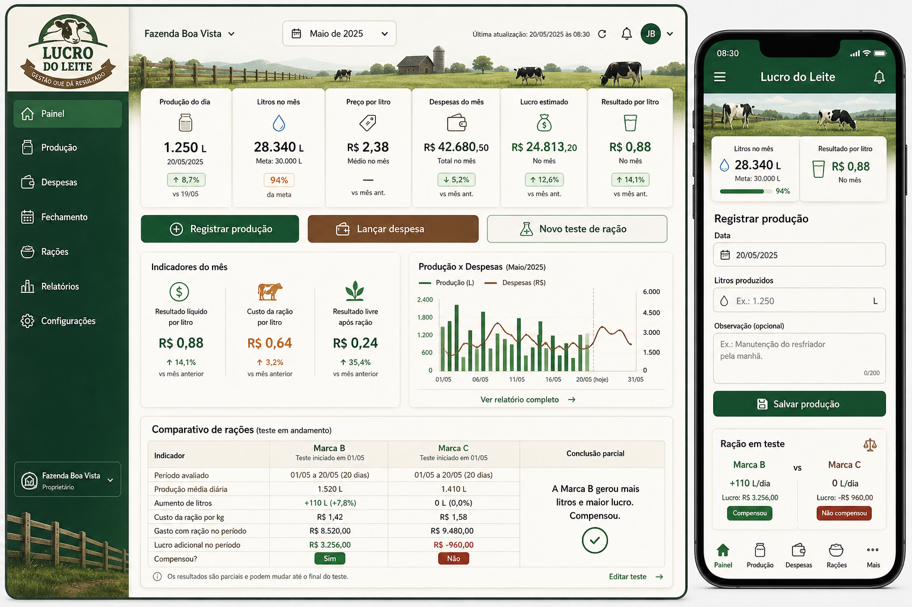

# Projeto Lucro do Leite

## 1. Visao Geral

**Lucro do Leite** e um aplicativo web responsivo para produtores de leite acompanharem producao, despesas, fechamento mensal, resultado por litro e comparativos de racoes.

O objetivo principal e responder, com dados reais:

- Quanto leite foi produzido no dia, no mes e no ano.
- Quanto foi recebido por litro.
- Quanto sobrou por litro depois da racao.
- Quanto sobrou por litro depois de todas as despesas.
- Qual marca de racao aumentou a producao.
- Qual marca de racao deu mais lucro, mesmo quando o preco dela e maior.
- Quando a racao aumentou litros, mas reduziu o lucro.

O app sera publicado na **Vercel** e usara banco de dados **Postgres**.

## 2. Conceito Visual

Direcao visual: rural, caipira profissional e limpa, sem parecer infantil.



### Regras de design

- Usar verde pasto, branco leite, texto grafite e detalhes moderados em madeira/palha.
- Interface objetiva, com botoes grandes para uso em celular.
- Primeira tela deve ser o app funcional, nao uma landing page.
- Evitar visual generico de SaaS urbano.
- Evitar excesso de marrom, textura pesada, foto de fundo ocupando a tela toda ou elementos decorativos que atrapalhem leitura.
- Cards com raio maximo de 8px.
- Tabelas e formularios devem ser legiveis em ambiente externo.

### Navegacao principal

- Painel
- Producao
- Despesas
- Fechamento
- Racoes
- Relatorios
- Configuracoes

No desktop, usar menu lateral. No mobile, usar barra inferior com os atalhos principais.

## 3. Stack Tecnica

### Frontend e backend

- **Next.js App Router**
- **TypeScript**
- **React**
- **Tailwind CSS**
- **Server Actions** para formularios simples
- **Route Handlers** para exportacoes, IA e endpoints externos
- **Zod** para validacao
- **React Hook Form** para formularios
- **Recharts** para graficos
- **lucide-react** para icones

### Banco de dados

- **Neon Postgres via Vercel Marketplace**
- **Drizzle ORM**
- **drizzle-kit** para migrations

Observacao: a Vercel nao oferece mais o antigo Vercel Postgres para novos projetos. A orientacao atual e conectar um provedor Postgres pelo Marketplace, como Neon.

Referencias:

- [Postgres on Vercel](https://vercel.com/docs/postgres)
- [Vercel Storage](https://vercel.com/docs/storage)
- [Neon Vercel Managed Integration](https://neon.com/docs/guides/vercel-managed-integration)

### Autenticacao

- Usar **Better Auth** com adaptador Drizzle/Postgres.
- MVP com email e senha.
- Todo dado operacional deve pertencer a uma fazenda.
- Um usuario pode participar de mais de uma fazenda.
- Cada fazenda tem membros com papeis.

### Relatorios

- **CSV** para planilhas simples.
- **XLSX** para Excel.
- **PDF** para impressao e envio.
- **HTML imprimivel** para relatorio rapido pelo navegador.

Bibliotecas sugeridas:

- `papaparse` ou geracao manual de CSV.
- `xlsx` para Excel.
- `jspdf` e `jspdf-autotable` para PDF.

## 4. Estrutura Inicial do Projeto

```text
lucro-do-leite/
  app/
    (auth)/
    (dashboard)/
      painel/
      producao/
      despesas/
      fechamento/
      racoes/
      relatorios/
      configuracoes/
    api/
      reports/
      ai/
  components/
    app-shell/
    charts/
    forms/
    reports/
    ui/
  db/
    schema.ts
    client.ts
    migrations/
  docs/
    assets/
      conceito-rural-lucro-do-leite.png
  lib/
    auth/
    calculations/
    exports/
    formatters/
    validations/
  tests/
    unit/
    integration/
    e2e/
```

## 5. Variaveis de Ambiente

```env
DATABASE_URL=
BETTER_AUTH_SECRET=
BETTER_AUTH_URL=
NEXT_PUBLIC_APP_NAME="Lucro do Leite"

# Segunda etapa, nao obrigatorio no MVP
GROQ_API_KEY=
OPENROUTER_API_KEY=
AI_PROVIDER=
AI_MODEL=
```

`DATABASE_URL` deve vir da integracao Neon no painel da Vercel.

## 6. Modelo de Permissoes

### Papeis

- `owner`: dono da fazenda, pode tudo.
- `admin`: gerencia usuarios, registros e configuracoes.
- `operator`: registra producao e despesas.
- `viewer`: apenas visualiza relatorios.

### Regra central

Toda consulta ao banco deve filtrar por `farm_id` e validar se o usuario autenticado pertence a fazenda.

Nenhuma rota pode aceitar `farm_id` livremente sem checar permissao.

## 7. Banco de Dados

### `users`

Gerenciada pela biblioteca de autenticacao.

Campos minimos esperados:

- `id`
- `name`
- `email`
- `email_verified`
- `image`
- `created_at`
- `updated_at`

### `farms`

```text
id uuid primary key
name text not null
owner_name text
city text
state text
milk_company text
default_price_per_liter numeric(12,4)
created_at timestamp not null
updated_at timestamp not null
```

### `farm_members`

```text
id uuid primary key
farm_id uuid not null references farms(id)
user_id text not null references users(id)
role text not null
created_at timestamp not null
updated_at timestamp not null
```

Indice unico:

```text
unique(farm_id, user_id)
```

### `daily_productions`

Registros diarios de producao.

```text
id uuid primary key
farm_id uuid not null references farms(id)
date date not null
liters numeric(12,3) not null
lactating_cows integer
batch_name text
feed_test_id uuid references feed_tests(id)
notes text
created_by text references users(id)
created_at timestamp not null
updated_at timestamp not null
```

Regras:

- `liters` nao pode ser negativo.
- `date` e obrigatoria.
- Deve existir no maximo um registro principal por fazenda e data, salvo se o app ativar controle por lote.

### `expenses`

```text
id uuid primary key
farm_id uuid not null references farms(id)
date date not null
reference_month text not null
category text not null
supplier text
description text not null
amount numeric(12,2) not null
feed_brand_id uuid references feed_brands(id)
feed_test_id uuid references feed_tests(id)
receipt_url text
created_by text references users(id)
created_at timestamp not null
updated_at timestamp not null
```

Categorias obrigatorias:

- Racao
- Sal mineral
- Medicamentos
- Veterinario
- Energia
- Combustivel
- Mao de obra
- Manutencao
- Transporte
- Outras despesas

Regras:

- `amount` nao pode ser negativo.
- Toda despesa deve pertencer a um mes de referencia.
- Despesa de categoria `Racao` pode ser vinculada a marca de racao e teste.

### `monthly_closings`

```text
id uuid primary key
farm_id uuid not null references farms(id)
month integer not null
year integer not null
reference_month text not null
total_liters numeric(12,3) not null
milk_invoice_amount numeric(12,2) not null
real_price_per_liter numeric(12,4) not null
total_feed_amount numeric(12,2) not null
total_expenses numeric(12,2) not null
feed_cost_per_liter numeric(12,4) not null
total_cost_per_liter numeric(12,4) not null
gross_result_per_liter numeric(12,4) not null
result_after_feed_per_liter numeric(12,4) not null
net_result_per_liter numeric(12,4) not null
net_profit numeric(12,2) not null
closed_by text references users(id)
closed_at timestamp
created_at timestamp not null
updated_at timestamp not null
```

Indice unico:

```text
unique(farm_id, reference_month)
```

### `feed_brands`

Cadastro das marcas de racao.

```text
id uuid primary key
farm_id uuid not null references farms(id)
name text not null
manufacturer text
protein_percent numeric(6,2)
bag_weight_kg numeric(8,3)
price_per_bag numeric(12,2)
price_per_kg numeric(12,4)
notes text
active boolean not null default true
created_at timestamp not null
updated_at timestamp not null
```

Regras:

- Se `price_per_bag` e `bag_weight_kg` forem informados, calcular `price_per_kg`.
- Permitir atualizar preco sem apagar historico dos testes antigos.

### `feed_tests`

Experimentos de racao.

```text
id uuid primary key
farm_id uuid not null references farms(id)
name text not null
status text not null
start_date date not null
end_date date
baseline_start_date date
baseline_end_date date
comparison_mode text not null
milk_price_per_liter numeric(12,4)
notes text
created_by text references users(id)
created_at timestamp not null
updated_at timestamp not null
```

`comparison_mode`:

- `before_after`: compara periodo antes e depois.
- `brand_vs_brand`: compara duas ou mais marcas no mesmo periodo.
- `batch_vs_batch`: compara lotes diferentes.

`status`:

- `draft`
- `running`
- `finished`
- `cancelled`

### `feed_test_variants`

Cada variante ou marca dentro de um teste.

```text
id uuid primary key
feed_test_id uuid not null references feed_tests(id)
feed_brand_id uuid references feed_brands(id)
label text not null
period_start date not null
period_end date not null
daily_feed_kg numeric(10,3)
total_feed_kg numeric(12,3)
feed_cost_total numeric(12,2)
average_daily_liters numeric(12,3)
baseline_daily_liters numeric(12,3)
extra_daily_liters numeric(12,3)
extra_total_liters numeric(12,3)
extra_revenue numeric(12,2)
additional_profit numeric(12,2)
break_even_liters numeric(12,3)
break_even_liters_per_day numeric(12,3)
result_per_liter numeric(12,4)
conclusion text
created_at timestamp not null
updated_at timestamp not null
```

Exemplos de `label`:

- Marca B
- Marca C
- Sem racao
- Racao anterior

### `report_exports`

Historico de relatorios gerados.

```text
id uuid primary key
farm_id uuid not null references farms(id)
type text not null
format text not null
reference_start date
reference_end date
file_name text
generated_by text references users(id)
created_at timestamp not null
```

### `app_settings`

```text
id uuid primary key
farm_id uuid not null references farms(id)
key text not null
value jsonb not null
created_at timestamp not null
updated_at timestamp not null
```

### `audit_logs`

```text
id uuid primary key
farm_id uuid references farms(id)
user_id text references users(id)
action text not null
entity text not null
entity_id text
metadata jsonb
created_at timestamp not null
```

## 8. Calculos Financeiros

Todos os calculos devem ficar em `lib/calculations`.

### Funcoes utilitarias

```ts
safeDivide(value, divisor, fallback = 0)
```

Nunca dividir por zero. Se o divisor for zero ou nulo, retornar `fallback` e exibir aviso na interface.

### Fechamento mensal

```text
preco_por_litro = valor_da_nota / total_de_litros

resultado_bruto_por_litro = valor_da_nota / total_de_litros

custo_racao_por_litro = total_gasto_com_racao / total_de_litros

resultado_livre_apos_racao = (valor_da_nota - total_gasto_com_racao) / total_de_litros

custo_total_por_litro = total_de_despesas / total_de_litros

resultado_liquido_por_litro = (valor_da_nota - total_de_despesas) / total_de_litros

lucro_liquido = valor_da_nota - total_de_despesas
```

### Estimativa sem fechamento

Se o mes ainda nao foi fechado:

```text
receita_estimada = total_litros_mes * preco_estimado_por_litro
lucro_estimado = receita_estimada - despesas_mes
resultado_estimado_por_litro = lucro_estimado / total_litros_mes
```

Ordem para definir preco estimado:

1. Preco manual informado no mes.
2. Ultimo fechamento mensal.
3. Preco padrao da fazenda.
4. Se nenhum existir, nao calcular e mostrar aviso.

## 9. Calculo de Racao e Comparacao de Marcas

A area de racoes deve permitir comparar efeitos reais na producao e no lucro.

### Cadastro da marca

Campos:

- Nome da marca
- Fabricante
- Peso do saco em kg
- Preco do saco
- Preco por kg calculado
- Percentual de proteina opcional
- Observacoes

### Novo teste de racao

Campos:

- Nome do teste
- Tipo de comparacao
- Data inicial
- Data final
- Preco do leite usado no teste
- Periodo base antes da racao
- Marcas ou variantes comparadas
- Consumo diario em kg por variante
- Lote ou grupo de animais opcional

### Modo antes/depois

Usar quando o produtor troca ou inicia uma racao e quer comparar com o periodo anterior.

```text
media_diaria_base = litros_periodo_base / dias_periodo_base
media_diaria_teste = litros_periodo_teste / dias_periodo_teste
aumento_diario_litros = media_diaria_teste - media_diaria_base
aumento_total_litros = aumento_diario_litros * dias_periodo_teste
receita_extra = aumento_total_litros * preco_por_litro
custo_racao_periodo = total_kg_racao * preco_por_kg
lucro_adicional = receita_extra - custo_racao_periodo
```

Conclusao:

- Se `lucro_adicional > 0`: compensou.
- Se `lucro_adicional < 0`: nao compensou.
- Se `lucro_adicional = 0`: apenas se pagou.

### Modo marca contra marca

Usar quando o produtor quer comparar, por exemplo, **Marca B** contra **Marca C**.

Para cada marca:

```text
media_diaria_marca = litros_periodo_marca / dias
aumento_diario_vs_base = media_diaria_marca - media_diaria_base
aumento_total_litros = aumento_diario_vs_base * dias
receita_extra = aumento_total_litros * preco_por_litro
custo_total_racao = kg_consumidos * preco_por_kg
lucro_adicional = receita_extra - custo_total_racao
```

Comparacao entre marcas:

```text
diferenca_litros = aumento_total_litros_marca_b - aumento_total_litros_marca_c
diferenca_custo = custo_total_marca_b - custo_total_marca_c
diferenca_lucro = lucro_adicional_marca_b - lucro_adicional_marca_c
```

Exemplos de conclusao automatica:

- "A Marca B aumentou a producao em 110 litros por dia e gerou R$ 3.256,00 de lucro adicional. Compensou."
- "A Marca C nao aumentou a producao e teve custo maior. Neste periodo, nao compensou."
- "A Marca C nao aumentou a producao, mas e mais barata. Ainda assim, o lucro adicional foi negativo."
- "A Marca B produziu mais leite, mas a Marca C deu melhor resultado financeiro por ter custo menor."

### Ponto de equilibrio da racao

```text
litros_extras_necessarios = custo_da_racao / preco_por_litro
litros_extras_por_dia_necessarios = litros_extras_necessarios / quantidade_de_dias
```

Mensagem:

```text
Para a racao se pagar, ela precisa gerar pelo menos X litros extras no periodo, ou Y litros extras por dia.
```

### Alertas da tela de racao

- Aumentou leite e aumentou lucro.
- Aumentou leite, mas reduziu lucro.
- Nao aumentou leite e ficou mais caro.
- Nao aumentou leite, mas reduziu custo.
- Resultado inconclusivo por falta de dias ou dados suficientes.

## 10. Telas

### Painel

Mostrar:

- Producao do dia
- Litros no mes
- Preco por litro
- Despesas do mes
- Lucro estimado
- Resultado por litro
- Resultado liquido por litro
- Custo da racao por litro
- Resultado livre apos racao
- Grafico Producao x Despesas
- Comparativo de racoes em andamento

Acoes rapidas:

- Registrar producao
- Lancar despesa
- Novo teste de racao
- Exportar relatorio

### Producao

Funcionalidades:

- Registrar producao diaria.
- Editar registro.
- Excluir registro com confirmacao.
- Ver historico por mes.
- Ver grafico diario.
- Vincular registro a teste de racao, se aplicavel.

Campos:

- Data
- Litros produzidos
- Vacas em lactacao opcional
- Lote opcional
- Teste de racao opcional
- Observacao

### Despesas

Funcionalidades:

- Cadastrar despesa.
- Filtrar por categoria, mes e fornecedor.
- Somar por categoria.
- Vincular despesa a marca ou teste de racao.

Campos:

- Data
- Categoria
- Descricao
- Valor
- Fornecedor
- Mes de referencia
- Marca de racao opcional
- Teste de racao opcional

### Fechamento

Funcionalidades:

- Selecionar mes.
- Carregar producao automaticamente.
- Carregar despesas automaticamente.
- Informar valor da nota.
- Calcular preco real por litro.
- Salvar fechamento.
- Reabrir fechamento com permissao de admin.

### Racoes

Funcionalidades:

- Cadastrar marcas.
- Atualizar preco.
- Criar teste de racao.
- Comparar marcas.
- Mostrar conclusao automatica.
- Mostrar ponto de equilibrio.
- Ver historico de testes.

### Relatorios

Tipos de relatorio:

- Producao diaria por periodo.
- Fechamento mensal.
- Despesas por categoria.
- Lucro por litro.
- Comparativo entre meses.
- Comparativo anual.
- Analise de racao por marca.
- Teste A/B de racao.
- Relatorio executivo da fazenda.
- Exportacao completa para backup.

Formatos:

- PDF
- CSV
- XLSX
- HTML para impressao

### Configuracoes

Campos:

- Nome da fazenda
- Cidade
- Estado
- Laticinio comprador
- Preco padrao por litro
- Unidade de medida
- Preferencias de relatorio
- Membros e permissoes

## 11. Rotas e APIs

### Paginas

```text
/login
/painel
/producao
/despesas
/fechamento
/racoes
/relatorios
/configuracoes
```

### APIs

```text
GET /api/reports/monthly
GET /api/reports/production
GET /api/reports/expenses
GET /api/reports/feed-tests
GET /api/reports/export
POST /api/ai/analysis
```

`/api/reports/export` deve aceitar:

```text
type=monthly|production|expenses|feed-test|annual|backup
format=pdf|csv|xlsx|html
startDate=YYYY-MM-DD
endDate=YYYY-MM-DD
farmId=<uuid>
```

Mesmo recebendo `farmId`, a API deve validar se o usuario tem acesso a fazenda.

## 12. Validacoes

### Regras gerais

- Nao permitir litros negativos.
- Nao permitir despesas negativas.
- Nao dividir por zero.
- Nao permitir fechamento sem producao.
- Nao permitir fechamento com valor de nota negativo.
- Permitir estimativa quando ainda nao existe nota.
- Mostrar valores em Real brasileiro.
- Mostrar datas no padrao brasileiro.
- Salvar datas em formato seguro no banco.

### Mensagens

Exemplos:

- "Nao ha producao registrada neste mes."
- "Informe o valor da nota para calcular o preco real por litro."
- "Este teste ainda nao tem dias suficientes para uma conclusao confiavel."
- "A racao aumentou a producao, mas o lucro liquido caiu."
- "A racao compensou financeiramente neste periodo."

## 13. Relatorios

### Relatorio mensal

Conteudo:

- Nome da fazenda
- Mes de referencia
- Total de litros
- Valor da nota
- Preco por litro
- Total de despesas
- Total de racao
- Lucro liquido
- Resultado liquido por litro
- Grafico de producao
- Tabela de despesas por categoria
- Observacoes importantes

### Relatorio de racao

Conteudo:

- Nome do teste
- Periodo
- Marca ou variante
- Custo por kg
- Consumo total
- Gasto total
- Media diaria de litros antes
- Media diaria durante o teste
- Aumento ou queda de litros
- Receita extra
- Lucro adicional
- Ponto de equilibrio
- Conclusao automatica

### Relatorio anual

Conteudo:

- Producao por mes
- Receita por mes
- Despesas por mes
- Lucro por mes
- Melhor mes
- Pior mes
- Evolucao do resultado por litro
- Ranking de categorias de despesa

## 14. IA - Segunda Etapa

A IA nao deve bloquear o MVP. A primeira versao deve funcionar totalmente sem IA.

### Provedores

- Groq
- OpenRouter

### Variaveis

```env
GROQ_API_KEY=
OPENROUTER_API_KEY=
AI_PROVIDER=groq|openrouter
AI_MODEL=
```

### Casos de uso

- Explicar relatorio mensal em linguagem simples.
- Gerar resumo executivo para o produtor.
- Identificar possiveis problemas: queda de producao, racao cara, despesa fora do padrao.
- Explicar se uma marca de racao compensou.
- Sugerir perguntas para investigar queda de lucro.

### Rota

```text
POST /api/ai/analysis
```

Entrada:

```json
{
  "farmId": "uuid",
  "type": "monthly|feed-test|annual",
  "reference": "2026-06"
}
```

Saida:

```json
{
  "summary": "texto em portugues simples",
  "alerts": ["alerta 1", "alerta 2"],
  "recommendations": ["recomendacao 1"]
}
```

### Regra de seguranca

Nunca enviar dados de outra fazenda para a IA.

## 15. Padrao de Codigo

- Usar TypeScript estrito.
- Separar calculos puros em `lib/calculations`.
- Separar formatacao em `lib/formatters`.
- Separar validacoes Zod em `lib/validations`.
- Componentes visuais reutilizaveis em `components/ui`.
- Componentes de tela devem compor componentes menores.
- Evitar componente gigante com toda a logica.
- Usar server-side filtering sempre que a lista puder crescer.

## 16. Testes

### Unitarios

Testar:

- Preco por litro.
- Custo de racao por litro.
- Resultado livre apos racao.
- Resultado liquido por litro.
- Lucro liquido mensal.
- Ponto de equilibrio.
- Comparacao Marca B x Marca C.
- Cenarios com zero litros.
- Cenarios sem fechamento.

### Integracao

Testar:

- Criar producao.
- Criar despesa.
- Criar fechamento.
- Criar marca de racao.
- Criar teste de racao.
- Exportar relatorio.

### E2E

Fluxo principal:

1. Login.
2. Selecionar fazenda.
3. Registrar producao.
4. Lancar despesa.
5. Cadastrar marca de racao.
6. Criar teste de racao.
7. Fechar mes.
8. Exportar PDF.

## 17. Deploy na Vercel

### Passos

1. Criar projeto no GitHub.
2. Importar na Vercel.
3. Instalar Neon pelo Vercel Marketplace.
4. Conectar o banco ao projeto.
5. Rodar migrations Drizzle.
6. Configurar variaveis de ambiente.
7. Fazer deploy de preview.
8. Validar login, banco e exportacoes.
9. Promover para producao.

### Ambientes

- `development`
- `preview`
- `production`

Recomendado habilitar branching de banco para previews, se disponivel no plano Neon usado.

## 18. Roadmap

### MVP

- Login.
- Uma fazenda por usuario inicialmente, com estrutura pronta para multiplas.
- Producao diaria.
- Despesas.
- Fechamento mensal.
- Dashboard.
- Cadastro de marcas de racao.
- Teste de racao simples.
- Relatorios PDF, CSV e XLSX.
- Deploy na Vercel com Neon.

### Versao 1.1

- Multiplas fazendas por usuario.
- Controle por lote.
- Melhorias no comparativo de racao.
- Historico de preco das marcas.
- Upload de comprovantes.

### Versao 1.2

- IA com Groq/OpenRouter.
- Analise automatica mensal.
- Alertas inteligentes.
- Recomendacoes baseadas nos dados.

### Versao 2

- App PWA offline-first.
- Sincronizacao quando voltar internet.
- Notificacoes.
- Importacao de planilhas.
- Painel multiusuario completo.

## 19. Criterios de Aceite

O projeto so deve ser considerado pronto quando:

- O app estiver publicado na Vercel.
- O banco Postgres estiver conectado.
- O usuario conseguir registrar producao e despesa.
- O fechamento mensal calcular todos os indicadores.
- A tela de racoes comparar marcas e mostrar conclusao.
- Os relatorios forem exportados em PDF, CSV e XLSX.
- Os dados forem isolados por fazenda e usuario.
- O visual seguir o conceito rural aprovado.
- A versao mobile for confortavel para uso no campo.

